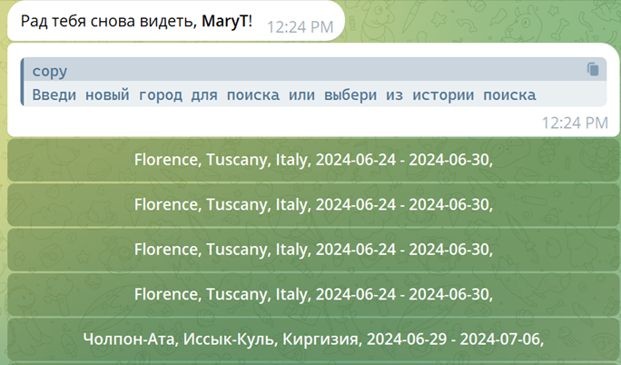
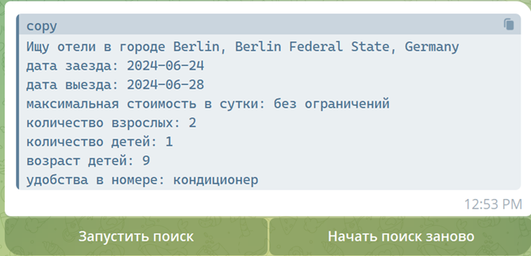
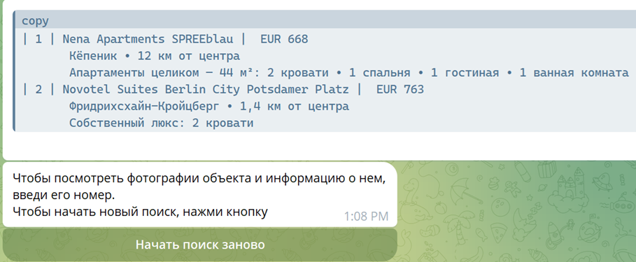

# Телеграм-бот для поиска отелей на сайте Booking.com
Этот бот позволяет быстро подбирать отели прямо в мессенджере Telegram задавая свои критерии поиска. 
Попробуйте использовать бот: https://t.me/Mary_Skillbox_bot

## Особенности

Данный бот позволяет:
* задавать диапазон дат, в том числе выбирая их из календаря;
* выбирать список локаций для поиска отелей согласно слову, введенному пользователем при запросе города;
* подбирать отели, ограничивая их по цене за сутки;
* выбирать количество взрослых и детей для поиска;
* делать фильтр отелей/апартаментов по наличию в них кондиционера, стиральной машины и кухни
* поддержка, зависимая от `language_code` от Telegram Bot API. 

## Requirements

* Python 3.12+
* [pyTelegramBotAPI](https://github.com/python-telegram-bot/python-telegram-bot) – Python Telegram Bot API (4.18.1)
* [python-dotenv](https://github.com/theskumar/python-dotenv) библиотека python-dotenv (1.0.1)
* [requests](https://github.com/psf/requests) - библиотека requests (2.32.2)
* [aiogram](https://github.com/aiogram/aiogram) - библиотека aiogram (3.7.0)
* [aiogram_calendar](https://github.com/noXplode/aiogram_calendar) - библиотека aiogram_calendar (0.5.0)
* [aiohttp](https://github.com/aio-libs/aiohttp) - библиотека aiohttp (3.9.5)
* [peewee](https://github.com/coleifer/peewee) - библиотека peewee (3.15.4)
* [sqlite3](https://sqlite.org/) - база данных sqlite3 (3.46.0)

Вы можете установить все зависимости, выполнив следующую команду: `pip install -r requirements.txt`

## Команды бота

* `/start` - запуск бота.

## Как работать с ботом

Вход в бота - команда /start. Далее бот запросит город для поиска и, если пользователь вошел не впервые, 
предложит список 10 последних поисков пользователя (с датами заезда и выезда). 

Если будет введен город вручную, то пользователю будет предложено выбрать локацию из списка, 
полученного ботом от booking api (названия которых похожи на введенный город). 

Если бот не найдет ни одну локацию, то необходимо ввести название города еще раз, возможно вы допустили 
ошибку при написании. 

Далее нужно выбрать даты заезда и выезда из календаря.

Если пользователь выберет строку из истории, то город и даты возьмутся из нее. 

После этого пользователю будет предложено выбрать валюту из списка всех валют, имеющихся на Booking.com.

И либо ограничить стоимость за сутки, либо ввести 0, чтобы показать отели за любую стоимость.

Далее пользователь выбирает количество проживающих: взрослых и детей.

И необходимые удобства в номере

После выбора и нажатия на кнопку "Готово", пользователь получает информацю о том, что он планирует 
искать и, если он согласен с этим выбором параметров, он нажимает на кнопку 
, чтобы получить список отелей, 
удовлетворяющих выбранным критериям.

Если пользователь решил изменить условия, ему нужно будет нажать на кнопку 
.

При наличии отелей, соответствующих критериям, пользователю выдастся их список и предложение ввести 
номер отеля из списка, чтобы посмотреть фотографии выбранного отеля, информацию о нем и его 
местоположение на карте google.

Пример результата:

### Рекомендации 

Название города должно состоять только из букв русского или латинского алфавита и символа дефис.
Количество взрослых и количество детей - это целые положительные числа.
Возраст детей (если их несколько) вводится через запятую.
Дата заезда должна быть не ранее текущей даты, а дата выезда - позднее даты заезда.

При ошибочном вводе любой из дат или количества людей, бот выведет соответствующее сообщение и 
попросит ввести значение повторно.
